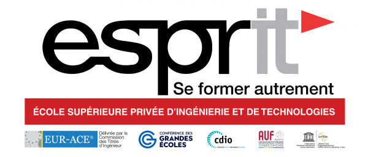

</a> 
</a> 
</a> 

## Espritchatbot V1.2
This is a chatbot designed to answer questions about Esprit University. It was created by a group of Esprit's Students called INNOVISION using the [Rasa](https://rasa.com/) framework.

## Prerequirments
Python 3.4+
Virtualenv
pip

## Installation
To open the chatbot, clone the repository to your local machine:

```
git clone https://github.com/kimou6055/Espritchatbot.git
```
All of the following will be built into a virtualenv

open the cmd in the root folder
do : 
```
cd ../

```

Then do the follow:

```
python -m venv myenv
```

Then activate the environnement

windows : 
```
myenv\Scripts\activate
```


linux : 
```
source myenv/bin/activate
```
Make sure you have Python 3.x installed on your machine. You can install the required Python libraries by running:

```
pip install rasa
pip install langdetect
pip install translate
pip install pynvml
pip install fuzzywuzzy

```

## Usage
To use the chatbot, navigate to the Espritchatbot directory and run these following commands:

1- if you are using the chatbot for the first time you will need to train it :

```
rasa train
```

2- Run the chatbot :

```
rasa shell
```
3- You will need to  run the actions

Open another cmd access the root then run :
```
rasa run actions --port 5055
```
4- Run the chatbot with nlu accuracy:

```
rasa shell nlu
```

## Credits

 Credits for Rasa project structure and implementation goes to INNOVISION
 
 INNOVISION Team Members: 
 - Med Karim Akkari
 - Nadia Bedhiafi
 - Sarra Gharsallah
 - Karim Aloulou
 - Yosr Abbassi
 - Med Hedi Souissi
 - Aziz Jebabli
